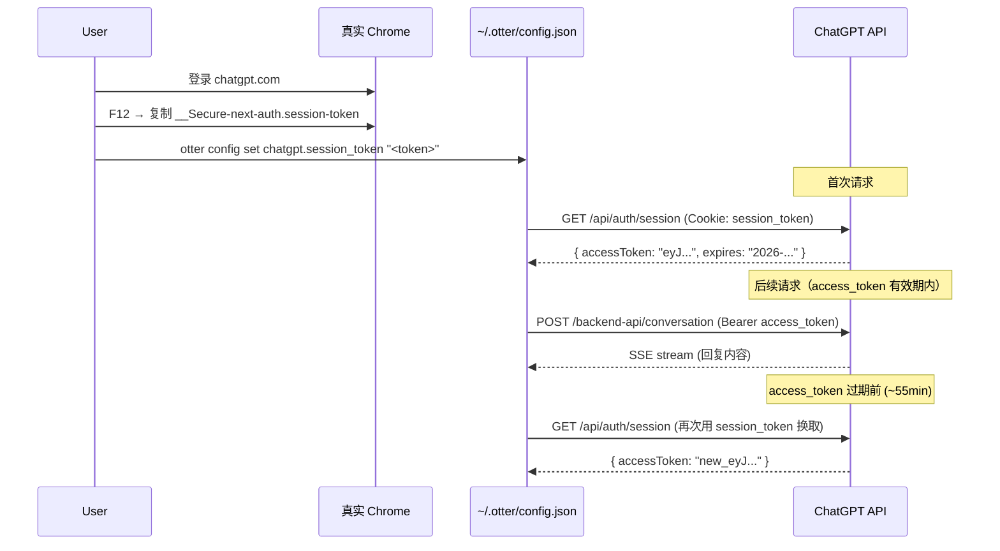

# ChatGPT & Gemini 逆向 Web API 可行性分析与实现规格

> 版本: v1  
> 最后更新: 2026-09-12  
> 状态: 设计分析阶段

---

## 目录

1. [问题背景](#1-问题背景)
2. [策略总览](#2-策略总览)
3. [ChatGPT Direct API 分析](#3-chatgpt-direct-api-分析)
4. [Gemini Web API 分析](#4-gemini-web-api-分析)
5. [推荐实现路径](#5-推荐实现路径)
6. [详细 API 规格](#6-详细-api-规格)
7. [代码修改清单](#7-代码修改清单)
8. [风险与注意事项](#8-风险与注意事项)

---

## 1. 问题背景

### 1.1 当前架构回顾

| Provider | 登录方式 | 发消息方式 | 状态 |
|---|---|---|---|
| **DeepSeek** | 账号密码 → Direct API | Direct API (SSE) | ✅ 正常工作 |
| **ChatGPT** | Playwright 浏览器 → 取 session_token | Direct API (SSE) | ⚠️ 登录受阻 |
| **Gemini** | Playwright 浏览器 → 取 cookie | 浏览器自动化 | ❌ 完全受阻 |

### 1.2 Playwright 被 Google 封禁的原因

Playwright 启动的 Chromium 浏览器在 Google 登录页面会被检测为"不安全环境"，原因如下：

| 检测向量 | 具体表现 |
|---|---|
| **`navigator.webdriver`** | Playwright/ChromeDriver 会设置此标志为 `true`，Google 会检查 |
| **TLS 指纹** | Playwright 的 Chromium 与用户本地 Chrome 的 TLS 握手特征不同 |
| **Chrome 扩展缺失** | Google 登录可能检测到缺少安全扩展（如 Google 自家的身份验证组件） |
| **User-Agent 异常** | Playwright 默认 Headless UA 与真实 Chrome 不同 |
| **行为模式** | 无鼠标轨迹、无滚动、瞬时操作，触发反自动化规则 |
| **WebDriver 特征** | `cdp` 通道、`chrome-extension//` 等特征暴露 |
| **Google 账户状态** | Playwright 的浏览器没有该设备的 Google 信任记录 |

**结论**：Playwright （或任何自动化框架）启动的浏览器**几乎不可能**通过 Google 登录页面的安全检查。

### 1.3 解决思路

既然浏览器自动化这条路走不通，我们需要换个思路获取认证凭据。

有三种可行方案：

```
方案 A: 人工提取 → 用户从真实 Chrome 粘 token
方案 B: 嫁接真实 Chrome → 通过 CDP 连接到已打开的 Chrome
方案 C: 全逆向 Direct API → 完全绕过浏览器（不依赖 cookie）
```

---

## 2. 策略总览

### 推荐策略矩阵

| 策略 | ChatGPT | Gemini |
|---|---|---|
| **方案 A：人工提取 + API** | ✅ 推荐（`chatgpt_api.go` 已就绪） | ⚠️ 可行（需要先分析 API） |
| **方案 B：嫁接真实 Chrome** | ✅ 可作为备用 | ✅ 可作为备用 |
| **方案 C：全逆向** | ⚠️ 不必要（API 已基本就绪） | ⚠️ 高风险（API 复杂且不稳定） |

### 推荐路径

```
近期（1-2 天）：
  ChatGPT → 方案 A（直接补 session_token 获取方式即可）
  Gemini  → 方案 A（人工提取 cookie + 逆向 API）

中期（1-2 周）：
  ChatGPT → 方案 B 自动化（CDP 自动从 Chrome 取 token）
  Gemini  → 方案 B 自动化（CDP + API 逆向）

长期：
  两者均完善为纯 Direct API，完全脱离浏览器
```

---

## 3. ChatGPT Direct API 分析

### 3.1 当前代码中已有的实现

`pkg/api/chatgpt_api.go` 已经实现了：

| 功能 | 端点 | 状态 |
|---|---|---|
| **session_token → access_token** | `GET /api/auth/session` | ✅ 已实现 |
| **发送消息（SSE 流）** | `POST /backend-api/conversation` | ✅ 已实现 |
| **文件上传** | `POST /backend-api/files/upload` | ✅ 已实现 |
| **SSE 解析** | — | ✅ 已实现 |
| **获取 session_token** | （需要浏览器） | ❌ 未实现 |

### 3.2 缺失的环节

唯一需要浏览器做的事：获取 `__Secure-next-auth.session-token` cookie 的值。

一条指令即可补完。一旦有了这个 token，整个流程无需浏览器：

```
session_token → GET /api/auth/session → access_token (JWT, ~1h 有效)
                                         ↓
access_token → POST /backend-api/conversation → SSE 流响应
access_token → POST /backend-api/files/upload → 文件上传
```

### 3.3 ChatGPT API 依赖关系

```
用户手动获取 session_token（一次性的）
    │
    ▼
otter config set chatgpt.session_token "xxx"
 或 export OTTER_CHATGPT_SESSION_TOKEN="xxx"
    │
    ▼
initChatGPTProvider() — 从配置或环境变量读取
    │
    ▼
GetAccessToken() — session_token → access_token（自动处理）
    │
    ▼
定时 55 分钟检查 → access_token 过期 → 用 session_token 重新换取
    │
    ▼
Send() / UploadFile() — 正常使用
```

### 3.4 已知端点列表（已实测可用）

```
基础 URL: https://chatgpt.com

GET  /api/auth/session
  → 需要 Cookie: __Secure-next-auth.session-token=<token>
  → 返回 { user, expires, accessToken, error }

POST /backend-api/conversation
  → 需要 Authorization: Bearer <access_token>
  → Body: { action, messages, model, ... }
  → 返回 text/event-stream (SSE)

POST /backend-api/files/upload
  → 需要 Authorization: Bearer <access_token>
  → Body: multipart/form-data (file field)
  → 返回 { id, filename, bytes, status }
```

---

## 4. Gemini Web API 分析

### 4.1 现状

Gemini 的 Provider (`pkg/provider/gemini.go`) 和 Gemini API 客户端（不存在）目前完全依赖浏览器自动化。`pkg/api/` 下**没有** gemini_api.go。

### 4.2 Gemini Web App 协议分析

Gemini 的 Web 前端使用**内部 gRPC-Web 协议**与后端通信，不是标准的 REST API。其架构大致如下：

```
浏览器
  │
  ├── Google 账户认证（通过 cookie）
  │     ├── __Secure-1PSID, __Secure-1PSIDTS, __Secure-1PSIDCC
  │     ├── SID, HSID, SSID, SAPISID, APISID
  │     └── ... 约 10+ 个 Google 认证 cookie
  │
  ├── 消息发送
  │     POST https://gemini.google.com/_/BardChatUi/data/assistant.lamda.BardFrontendService/StreamGenerate
  │     Content-Type: application/x-www-form-urlencoded;charset=UTF-8
  │     Body: 多层嵌套编码（JSON-in-JSON 结构）
  │     Response: multipart/mixed; boundary=...
  │               每个 chunk 包含 JSON 编码的增量数据
  │
  ├── 文件上传
  │     POST https://gemini.google.com/_/BardChatUi/data/upload
  │     或通过 Google Drive API 中转
  │
  └── 会话管理
      通过同一个 StreamGenerate 端点管理
```

### 4.3 认证依赖（Google Cookie）

与 ChatGPT 不同，Gemini 直接使用 Google 统一认证体系，需要完整的一组 Google cookie：

| Cookie 名称 | 作用 | 是否 HttpOnly | 是否 Secure |
|---|---|---|---|
| `__Secure-1PSID` | Google 认证核心令牌 | ✅ | ✅ |
| `__Secure-1PSIDTS` | Token 签名 | ✅ | ✅ |
| `__Secure-1PSIDCC` | 地区/安全信息 | ✅ | ✅ |
| `SAPISID` | API 认证 | ❌ | ✅ |
| `APISID` | 用户偏好 | ❌ | ✅ |
| `HSID` | 安全哈希 | ✅ | ✅ |
| `SSID` | 会话 ID | ✅ | ✅ |
| `SID` | Google 账户标识 | ✅ | ✅ |

> 手动提取这些 cookie 是可行的（从真实 Chrome 的 cookie 存储中导出），但由于 HttpOnly 限制，不能通过 `document.cookie` 获取，需要从 Chrome 的 cookie 数据库文件（macOS: `~/Library/Application Support/Google/Chrome/Default/Cookies`）中读取。

### 4.4 消息接口结构（已知）

请求格式（简化的近似结构）：

```
POST /_/BardChatUi/data/assistant.lamda.BardFrontendService/StreamGenerate
Content-Type: application/x-www-form-urlencoded;charset=UTF-8

f.req=[[["rqEMiH1rV4U","[\"用户消息文本\"]",null,"USER_PROMPT_TYPE"]]]
```

> 注意：`rqEMiH1rV4U` 是 RPC ID，可能随时间变化。其他参数包括 `at`（snapshot 参数）、`-`（后端请求 ID）等。

响应格式（多部分边界分隔）：

```
--boundary
Content-Type: application/json

[["wrb.fr","StreamGenerate","[...JSON编码的响应数据...]"]]
--boundary
Content-Type: application/json

["d","{\"c\":[{\"cid\":\"...\",\"children\":[...]}]}","null","null"]
--boundary--
```

### 4.5 逆向风险分析

| 风险项 | 等级 | 说明 |
|---|---|---|
| **RPC ID 变更** | 🔴 高 | 服务端方法名（如 `rqEMiH1rV4U`）可能随前端更新而变化 |
| **编码格式变更** | 🟡 中 | JSON-in-JSON 编码的层数和格式可能变化 |
| **响应结构复杂** | 🔴 高 | 响应包含多层嵌套编码，解析逻辑脆弱 |
| **cookie 过期** | 🟡 中 | Google cookie 有效期不定，需要刷新机制 |
| **文件上传协议** | 🟡 中 | 上传可能通过 Google Drive 中转，路径复杂 |
| **流式响应** | 🟡 中 | 自定义流式格式，非标准 SSE |

**结论**：Gemini 的逆向难度显著高于 ChatGPT，属于**高风险、中收益**。

---

## 5. 推荐实现路径

### 5.1 ChatGPT — 近期方案（1-2 天）

核心策略：**不依赖浏览器，用户手动提供 session_token**

```
┌─────────────────────────────────────────────────┐
│ 用户操作（一次性的）：                              │
│ 1. 在真实 Chrome 中登录 chatgpt.com                │
│ 2. F12 → Application → Cookies → 找到              │
│    __Secure-next-auth.session-token，复制值         │
│ 3. otter config set chatgpt.session_token <值>     │
│ 或 export OTTER_CHATGPT_SESSION_TOKEN=<值>         │
└─────────────────────────────────────────────────┘
        │
        ▼
┌─────────────────────────────────────────────────┐
│ otter 自动处理：                                   │
│ 1. 读 session_token → GET /api/auth/session      │
│ 2. 拿到 access_token → 正常发送消息              │
│ 3. 55 分钟自动 refresh（session_token 重新换取）    │
│ 4. 关闭时 access_token 丢弃，session_token 保留      │
└─────────────────────────────────────────────────┘
```

**需要修改的代码**：
- `pkg/cli/auth.go` — 移除 Playwright 依赖，改为提示用户手动提取
- `pkg/cli/send.go` — `initChatGPTProvider()` 支持从配置文件读 session_token
- `pkg/config/config.go` — `ProviderConfig` 加 `SessionToken` 字段
- `pkg/cli/config.go` — 支持 `otter config set chatgpt.session_token`

### 5.2 ChatGPT — 中期方案（1-2 周）

核心策略：**通过 CDP 连接真实 Chrome，自动提取 cookie**

```
otter auth login gpt
  → 提示"请在 Chrome 中登录 chatgpt.com"
  → 检测本地 Chrome 的 remote-debugging-port
  → 通过 CDP 连接 → 导航到 chatgpt.com
  → 检查是否已登录 → 读取 __Secure-next-auth.session-token
  → 保存到配置
```

这需要用户先在真实 Chrome 中完成登录，但比手动复制值更方便。

### 5.3 Gemini — 近期方案（1-2 周）

核心策略：**用户手动导出 Google cookie + 逆向主要 API**

```
┌─────────────────────────────────────────────────┐
│ 用户操作（一次性的）：                              │
│ 1. 在真实 Chrome 中登录 gemini.google.com          │
│ 2. 使用 Chrome 扩展 / Cookie dump 工具导出 cookie  │
│ 3. otter config set gemini.cookie_file <路径>      │
└─────────────────────────────────────────────────┘
        │
        ▼
┌─────────────────────────────────────────────────┐
│ otter 自动处理：                                   │
│ 1. 从 cookie 文件恢复 Google 认证 cookie          │
│ 2. 构造 gRPC-Web 请求发送消息                     │
│ 3. 解析自定义多部分响应                           │
│ 4. 持续复用 cookie（直到过期）                      │
└─────────────────────────────────────────────────┘
```

### 5.4 Gemini — 备用方案：嫁接真实 Chrome

如果 API 逆向太脆弱，可以用 CDP 连接到用户真实 Chrome，通过页面操作。
这比 Playwright 启动的虚拟浏览器更可靠。

---

## 6. 详细 API 规格

### 6.1 ChatGPT API 规格

#### 6.1.1 认证流



#### 6.1.2 端点详述

##### `GET /api/auth/session`

**用途**：将 session_token 换取短时效的 access_token

**请求头**：
```
Cookie: __Secure-next-auth.session-token=<值>
User-Agent: Mozilla/5.0 (Macintosh; Intel Mac OS X 10_15_7) ...
```

**响应（200 OK）**：
```json
{
  "user": {
    "id": "user-xxx",
    "name": "用户名",
    "email": "user@example.com",
    "image": "https://...",
    "picture": "https://...",
    "groups": [],
    "plan": "plus"   // 或 "free"
  },
  "expires": "2026-09-12T12:00:00.000Z",
  "accessToken": "eyJhbGciOiJSUzI1NiI...（JWT）"
}
```

**错误响应**：
```json
{
  "error": "RefreshAccessTokenError"
}
```
→ 说明 session_token 已过期，需要重新登录。

##### `POST /backend-api/conversation`

**用途**：发送消息，接收 SSE 流式回复

**请求头**：
```
Authorization: Bearer <access_token>
Content-Type: application/json
Accept: text/event-stream
User-Agent: Mozilla/5.0 (Macintosh; Intel Mac OS X 10_15_7) ...
```

**请求体**：
```json
{
  "action": "next",
  "messages": [
    {
      "id": "msg-1723456789012345678",
      "author": {
        "role": "user"
      },
      "content": {
        "content_type": "text",
        "parts": ["用户的消息文本"]
      }
    }
  ],
  "parent_message_id": "msg-parent-id",
  "model": "text-davinci-002-render-sha",
  "timezone_offset_min": -480,
  "suggestions": [],
  "history_and_training_disabled": true,
  "conversation_mode": {
    "kind": "primary_assistant"
  },
  "force_paragen": false,
  "force_rate_limit": false,
  "conversation_id": "conv-id-xxx"  // 首轮不传，后续追问传
}
```

**响应（SSE 流）**：

数据帧格式：
```
data: {"message": {"id": "msg-xxx", "role": "assistant",
       "content": {"content_type": "text", 
       "parts": ["增量文本", "更多增量"]},
       "status": "in_progress"}, 
       "conversation_id": "conv-id-xxx"}
```

**当前代码中 `chatgpt_api.go` 的 SSE 解析已完整实现**，包括：
- 增量文本帧（`parts` 数组）
- 元数据帧（`conversation_id`）
- 完成帧（`finish_reason` / `status === "finished"`）
- 错误帧（`error` 字段）

##### `POST /backend-api/files/upload`

**用途**：上传文件附件

**请求头**：
```
Authorization: Bearer <access_token>
Content-Type: multipart/form-data; boundary=...
```

**请求体**：`multipart/form-data`，字段名 `file`

**响应**：
```json
{
  "id": "file-xxx",
  "filename": "report.pdf",
  "bytes": 12345,
  "status": "uploaded",
  "uploaded_at": 1723456789
}
```

**注意事项**：
- ChatGPT 在消息中引用文件的方式是通过 `file_upload_id`
- 免费版有文件大小限制（约 512MB）
- `parts` 数组中可以包含用户文本和文件引用

#### 6.1.3 关键配置变更

`ProviderConfig` 新增字段：
```go
type ProviderConfig struct {
    Account      string `json:"account,omitempty"`
    Password     string `json:"password,omitempty"`
    SessionToken string `json:"session_token,omitempty"` // ← 新增：用户手动提供的 session_token
    AuthToken    string `json:"auth_token,omitempty"`     // access_token（运行期，不持久化到配置）
    CookiesPath  string `json:"cookies_path,omitempty"`
    AuthType     string `json:"auth_type,omitempty"`
}
```

优先级链（从高到低）：
1. 环境变量 `OTTER_CHATGPT_SESSION_TOKEN`
2. 环境变量 `OTTER_CHATGPT_ACCESS_TOKEN`（直接跳过 session 换取）
3. 配置文件 `chatgpt.session_token`
4. 配置文件 `auth_token`（之前保留的 access_token，可能已过期）
5. 提示用户手动执行 `otter config set chatgpt.session_token`

### 6.2 Gemini API 规格

#### 6.2.1 当前已确认的信息

以下信息基于对 gemini.google.com Web App 的观察（2026-09）：

**基础 URL**: `https://gemini.google.com`

**认证 cookie 集合**（来自 Google 统一认证）：
```
__Secure-1PSID
__Secure-1PSIDTS
__Secure-1PSIDCC
SAPISID
APISID
HSID
SSID
SID
SIDCC
__Secure-3PSID
__Secure-3PSIDTS
__Secure-3PSIDCC
```

> **关键发现**：只要拥有这组 cookie，无需 OAuth 交互即可认证。这意味着一组 cookie 即是一个"已经登录的浏览器身份"。

#### 6.2.2 主要端点分析

##### 消息发送端点（推测结构）

```
POST https://gemini.google.com/_/BardChatUi/data/assistant.lamda.BardFrontendService/StreamGenerate
Content-Type: application/x-www-form-urlencoded;charset=UTF-8
Cookie: <完整 Google cookie 集合>

f.req=[[["rqEMiH1rV4U","[\"用户消息\"]",null,"USER_PROMPT"]]]
```

> ⚠️ **重要**：`rqEMiH1rV4U` 是当前版本的 RPC 方法标识，后续可能变化。
> 需要通过抓包确认最新的 RPC ID。

##### 响应格式

```
Content-Type: multipart/mixed; boundary=xxx
```

每个的部分包含 JSON 编码的数据：
```
--xxx
Content-Type: application/json

[["wrb.fr","StreamGenerate","[\"编码的响应数据\"]",...]]
--xxx
Content-Type: application/json

["d","{\"children\":[{\"text\":\"回复内容\"}]}",...]
--xxx--
```

#### 6.2.3 逆向步骤（待实施）

| 步骤 | 操作 | 工具 |
|---|---|---|
| 1 | 在真实 Chrome 中登录 gemini.google.com | Chrome DevTools |
| 2 | 打开 F12 → Network 面板，勾选 "Preserve log" | Chrome DevTools |
| 3 | 发送一条消息，观察网络请求 | Chrome DevTools |
| 4 | 定位 `StreamGenerate` 请求 | Chrome DevTools |
| 5 | 复制为 cURL（右键 → Copy as cURL） | Chrome DevTools |
| 6 | 分析请求体和请求头的结构 | — |
| 7 | 分析响应体的解码方式 | — |
| 8 | 编写 Go 客户端 | — |

#### 6.2.4 风险备案

| 问题 | 影响 | 缓解措施 |
|---|---|---|
| RPC ID 变更 | 请求失败 | 通过正则从首页 JS 提取最新 RPC ID |
| cookie 失效 | 认证失败 | 提示用户重新导出 cookie |
| 响应结构变更 | 解析失效 | 增加灵活的 JSON 解析，尽早报警 |
| 文件上传路径复杂 | 上传功能不可用 | 初期不支持文件上传，仅文本对话 |

---

## 7. 代码修改清单

### 7.1 ChatGPT 修改（近期 — 1-2 天）

#### `pkg/config/config.go`

```go
// ProviderConfig 新增字段
type ProviderConfig struct {
    Account      string `json:"account,omitempty"`
    Password     string `json:"password,omitempty"`
    SessionToken string `json:"session_token,omitempty"` // ← 新增
    AuthToken    string `json:"auth_token,omitempty"`
    CookiesPath  string `json:"cookies_path,omitempty"`
    AuthType     string `json:"auth_type,omitempty"`
}
```

#### `pkg/api/chatgpt_api.go`

**无需修改** — `SetSessionToken()` 和 `GetAccessToken()` 已经完整可用。

#### `pkg/provider/chatgpt.go`

```go
// ChatGPTProvider 新增方法
func (c *ChatGPTProvider) SetSessionToken(token string) {
    c.sessionToken = token
    c.api.SetSessionToken(token)
}

// ensureAuthenticated 增加自动 refresh 逻辑
func (c *ChatGPTProvider) ensureAuthenticated(ctx context.Context) error {
    if c.accessToken != "" {
        // 尝试发送请求验证 token 是否有效
        // 如果返回 401，自动用 session_token 重新换取
    }
    if c.sessionToken == "" {
        return fmt.Errorf("ChatGPT 未登录。请先设置 session_token:\n" +
            "  1. 在 Chrome 中登录 chatgpt.com\n" +
            "  2. F12 → Application → Cookies → 复制 __Secure-next-auth.session-token\n" +
            "  3. otter config set chatgpt.session_token <值>")
    }
    _, err := c.api.GetAccessToken(ctx)
    return err
}
```

#### `pkg/cli/send.go` — `initChatGPTProvider()`

```go
func initChatGPTProvider(cg *provider.ChatGPTProvider) error {
    // 优先级 1: 环境变量 access_token
    if token := os.Getenv("OTTER_CHATGPT_ACCESS_TOKEN"); token != "" {
        cg.SetAccessToken(token)
        return nil
    }
    // 优先级 2: 环境变量 session_token
    if token := os.Getenv("OTTER_CHATGPT_SESSION_TOKEN"); token != "" {
        cg.SetSessionToken(token)
        return nil
    }
    // 优先级 3: 配置文件 access_token
    if appConfig.ChatGPT.AuthToken != "" {
        cg.SetAccessToken(appConfig.ChatGPT.AuthToken)
        return nil
    }
    // 优先级 4: 配置文件 session_token ← 新增
    if appConfig.ChatGPT.SessionToken != "" {
        cg.SetSessionToken(appConfig.ChatGPT.SessionToken)
        return nil
    }
    // 优先级 5: 提示手动设置（不再尝试浏览器登录）
    return fmt.Errorf("ChatGPT 未配置 session_token。\n\n" +
        "请执行以下步骤：\n" +
        "  1. 用 Chrome 打开 https://chatgpt.com 并登录\n" +
        "  2. F12 → Application → Cookies → 找到 __Secure-next-auth.session-token\n" +
        "  3. 复制其 Value\n" +
        "  4. 执行: otter config set chatgpt.session_token \"<复制的值>\"\n" +
        "  或设置环境变量: export OTTER_CHATGPT_SESSION_TOKEN=\"<复制的值>\"")
}
```

#### `pkg/cli/auth.go` — `chatGPTLogin()`

```go
func chatGPTLogin(cmd *cobra.Command) error {
    // 不再启动浏览器，改为提示手动操作
    fmt.Println("🔑 ChatGPT 登录方式已变更：")
    fmt.Println("")
    fmt.Println("  Playwright 启动的浏览器会被 Google 拦截，")
    fmt.Println("  请使用你的真实 Chrome 浏览器完成登录并提取 session_token。")
    fmt.Println("")
    fmt.Println("  步骤：")
    fmt.Println("    1. 用 Chrome 打开 https://chatgpt.com 并登录")
    fmt.Println("    2. F12 → Application → Cookies → https://chatgpt.com")
    fmt.Println("    3. 找到 __Secure-next-auth.session-token 行，双击 Value 列复制")
    fmt.Println("    4. 执行：otter config set chatgpt.session_token \"<复制的值>\"")
    fmt.Println("")
    fmt.Println("  session_token 有效期很长，一次提取可长期使用。")
    fmt.Println("  过期后重新执行一次以上步骤即可。")
    return nil
}
```

#### `pkg/cli/config.go` — 支持 `chatgpt.session_token`

```go
// config set 命令增加 session_token 的支持
// 已有的 key 映射扩展：
//   chatgpt.session_token → ChatGPT.SessionToken
```

### 7.2 Gemini 修改（近期 — 1-2 周）

#### `pkg/api/gemini_api.go`（新建）

```go
// Package api — Gemini Web API 客户端（逆向实现）
//
// 注意：Gemini Web App 使用内部 gRPC-Web 协议，
// 端点和方法标识可能因前端更新而变化。
package api

type GeminiAPI struct {
    client    *Client
    cookies   map[string]string  // Google 认证 cookie
    userAgent string
}

// NewGeminiAPI 创建 Gemini API 客户端
func NewGeminiAPI() *GeminiAPI

// SetCookies 设置 Google 认证 cookie（从文件加载）
func (g *GeminiAPI) SetCookies(cookies map[string]string)

// SetCookieFile 从 Chrome cookie 数据库文件加载 cookie
func (g *GeminiAPI) SetCookieFile(path string) error

// Send 发送消息并返回 SSE 流（转换为标准 StreamChunk）
func (g *GeminiAPI) Send(ctx context.Context, prompt string, 
    conversationID string) (<-chan StreamChunk, error)
```

#### `pkg/provider/gemini.go` — 重构

```go
// GeminiProvider 重构为双模式：
// mode = "api"  ：使用 Direct API（推荐）
// mode = "browser"：使用浏览器自动化（备选，CDP 方式）
type GeminiProvider struct {
    api          *api.GeminiAPI
    cookiesPath  string
    account      string
    password     string
    mode         string  // "api" | "browser"
}

// Login 改为提示手动导出 cookie
func (g *GeminiProvider) Login(ctx context.Context) error {
    fmt.Println("🔑 Gemini 登录方式：")
    fmt.Println("")
    fmt.Println("  1. 用 Chrome 打开 https://gemini.google.com 并登录")
    fmt.Println("  2. 安装 Cookie-Editor 或类似扩展")
    fmt.Println("  3. 导出全部 cookie 为 JSON")
    fmt.Println("  4. 保存到文件，然后执行：")
    fmt.Println("     otter config set gemini.cookie_file <文件路径>")
    return nil
}
```

#### `pkg/cli/auth.go` — `geminiLogin()`

与 ChatGPT 类似，改为提示手动操作。

### 7.3 CDP 嫁接真实 Chrome（中期）

#### `pkg/browser/cdp.go`（新建）

```go
// Package browser — CDP 方式连接真实 Chrome 实例
//
// 通过 Chrome DevTools Protocol 连接到用户正在运行的 Chrome，
// 提取 cookie / session_token，避免 Playwright 的检测问题。
package browser

type CDPConnector struct {
    port        int
    wsURL       string
    cookiesPath string
}

// Connect 连接到本地 Chrome 的调试端口
// 用户需要先在 Chrome 中启用远程调试：
//   /Applications/Google\ Chrome.app/... --remote-debugging-port=9222
func (c *CDPConnector) Connect() error

// ExtractCookie 从 Chrome 中提取指定域的 cookie
func (c *CDPConnector) ExtractCookie(domain, name string) (string, error)

// ExtractCookies 提取指定域的所有 cookie
func (c *CDPConnector) ExtractCookies(domain string) (map[string]string, error)
```

**使用方法**：
1. 用户关闭所有 Chrome 窗口
2. 用 `--remote-debugging-port=9222` 重新启动 Chrome
3. 在 Chrome 中登录目标网站
4. `otter auth login gpt` → CDP 连接 → 提取 cookie → 保存

---

## 8. 风险与注意事项

### 8.1 session_token / cookie 安全性

```bash
# session_token 相当于密码，要妥善保管
chmod 600 ~/.otter/config.json

# 不要在版本控制中提交配置
echo "~/.otter/" >> .gitignore
```

### 8.2 过期处理机制

| 凭据类型 | 有效期 | 自动刷新 |
|---|---|---|
| ChatGPT session_token | 数月（Google 登录有效期内） | 不支持自动刷新，过期需手动重新提取 |
| ChatGPT access_token | ~1 小时 | 支持（用 session_token 自动重新换取） |
| Gemini Google cookie | 数小时 ~ 数天 | 不支持，过期需手动重新导出 |
| DeepSeek auth_token | 数月 | 支持（账号密码自动重新登录） |

### 8.3 关于未来 API 稳定性

| Provider | API 稳定性 | 说明 |
|---|---|---|
| ChatGPT | 🟡 中等 | 接口相对稳定，变化有规律 |
| Gemini | 🔴 较低 | 内部 gRPC-Web 协议，变化不通知 |
| DeepSeek | 🟢 较高 | 已稳定运行数月 |

### 8.4 如果 API 再次失效的应急预案

```
1. ChatGPT:
   → 退回手动提取 session_token（方案不变，只是重新复制一次值）

2. Gemini:
   → 启动应急浏览器模式：用 CDP 连接到真实 Chrome
   → 用户在 Chrome 中手动操作，otter 读取页面内容
   
3. 通用兜底：
   → 所有 provider 都支持环境变量直接传入认证信息
   → 用户总可以手动完成最关键的步骤
```

---

## 附录 A：用户操作指南（ChatGPT session_token 提取）

```
一、获取 session_token
────────────────────────────────────────
1. 用 Chrome 打开 https://chatgpt.com
2. 如果未登录，完成登录
3. 按 F12 打开 DevTools
4. 切换到 Application 标签
5. 左侧展开 Cookies → 选择 https://chatgpt.com
6. 在列表中找到 __Secure-next-auth.session-token
7. 双击 Value 列的值，Ctrl+C 复制
8. 粘贴到安全的地方（仅用于配置）

二、配置到 otter
────────────────────────────────────────
otter config set chatgpt.session_token "<粘贴的值>"

# 验证
otter auth check chatgpt
# 应显示 ✅

# 测试发送
otter gpt "你好"
```

## 附录 B：用户操作指南（Gemini cookie 导出）

```
一、导出 Google cookie
────────────────────────────────────────
方法 1：使用 Cookie-Editor 扩展
1. 安装 Cookie-Editor Chrome 扩展
2. 打开 https://gemini.google.com
3. 点击 Cookie-Editor 图标
4. 点击 "Export" → 复制全部 JSON
5. 保存到 ~/.otter/sessions/gemini/cookies.json

方法 2：从 Chrome cookie 数据库直接读取
（CLI 工具可自动完成，无需用户操作）
otter auth login gem
→ 工具会提示确切的路径和步骤

二、配置到 otter
────────────────────────────────────────
otter config set gemini.cookie_file ~/.otter/sessions/gemini/cookies.json

# 验证
otter auth check gemini
# 应显示 ✅
```

---

## 附录 C：CDP 方案快速启动命令

```bash
# 1. 先确保所有 Chrome 窗口已关闭
killall "Google Chrome"

# 2. 以调试模式启动 Chrome（保持此终端运行）
/Applications/Google\ Chrome.app/Contents/MacOS/Google\ Chrome \
  --remote-debugging-port=9222 \
  --user-data-dir=/tmp/otter-chrome

# 3. 在新终端中执行 otter 认证
otter auth login gpt  # 自动通过 CDP 连接

# 4. 正常使用
otter gpt "你好，世界"
```

---

## 附录 D：验证清单

### ChatGPT 验证

```bash
# 1. 手动设置 session_token
export OTTER_CHATGPT_SESSION_TOKEN="xxx"
# 或
otter config set chatgpt.session_token "xxx"

# 2. 检查认证
otter auth check chatgpt
# 预期: [✅] chatgpt — 已认证

# 3. 发送消息
otter gpt "用一句话介绍自己"
# 预期: 正常返回 ChatGPT 的回复

# 4. 文件上传
echo "test" > /tmp/test.md
otter gpt -f /tmp/test.md "解释这个文件"

# 5. 多轮对话
otter gpt "我的名字是张三"
otter gpt "我叫什么名字？"
# 预期: 应该记住"张三"

# 6. 会话管理
otter session new gpt --title "测试会话"
otter session list gpt
otter session select gpt <session-id>
```

### Gemini 验证（API 逆向完成后）

```bash
# 1. 设置 cookie 文件
otter config set gemini.cookie_path ~/gemini-cookies.json

# 2. 检查认证
otter auth check gemini
# 预期: [✅] gemini — 已认证

# 3. 发送消息
otter gem "用一句话介绍自己"
# 预期: 正常返回 Gemini 的回复

# 4. 多轮对话
otter gem "我的名字是李四"
otter gem "我叫什么名字？"
```

---

## 附录 E：时间线估计

| 阶段 | 工作项 | 预计工时 | 依赖 |
|---|---|---|---|
| **P1** | ChatGPT 手动 session_token 模式 | 2 天 | 现有 `chatgpt_api.go` |
| **P1** | 修改认证提示信息 | 0.5 天 | — |
| **P2** | Gemini Web API 逆向（抓包分析） | 2 天 | Chrome DevTools |
| **P2** | 编写 `gemini_api.go` | 3 天 | 逆向结果 |
| **P2** | 修改 Gemini Provider | 1 天 | `gemini_api.go` |
| **P3** | CDP cookie 自动提取 | 2 天 | — |
| **P3** | session_token/access_token 自动 refresh | 1 天 | — |
| **P4** | 支持文件上传 to Gemini API | 3 天 | API 逆向 |